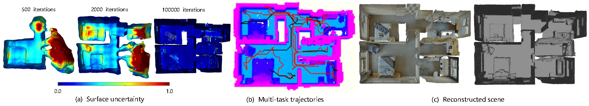

# Autonomous Implicit Indoor Scene Reconstruction with Frontier Exploration

**Accepted by ICRA 2024 (AIISRFE).**



Project Page: [https://small-zeng.github.io/AIISRFE/](https://small-zeng.github.io/AIISRFE/)  
Paper Link: [https://arxiv.org/abs/2404.10218](https://arxiv.org/abs/2404.10218)  

## Unity Project in Windows

Please refer to [Install Unity and Visual Studio on Windows](https://learn.microsoft.com/zh-cn/visualstudio/gamedev/unity/get-started/getting-started-with-visual-studio-tools-for-unity?pivots=windows). Our environment includes Unity 2019.4.40 and Visual Studio 2019. Please make sure installed environment is not lower than this version.

## Installation

```bash
git clone https://github.com/small-zeng/AIISRFE.git
cd AIISRFE
```

### Install with conda in Ubuntu

```bash
conda env create -f environment.yml
conda activate EVPP
```


1. Run Unity Project

```bash
After install Unity Editor and Visual Studio, you can start it by click RUN button in Unity Editor.
```

2. Open one terminal and start reconstruction service:

```bash
cd monosdfServer_unity
python manage.py runserver 0.0.0.0:7000
```

3. Open another terminal and start planner service:

Make sure that the Windows and Ubuntu machines are on the same local network.

```bash 
catkin_make
source devel/setup.sh
roslaunch exploration_manager rviz.launch
roslaunch exploration_manager exploration_multi_room.launch
```

## BibTeX

@article{zeng2024autonomous,
  title={Autonomous Implicit Indoor Scene Reconstruction with Frontier Exploration},
  author={Zeng, Jing and Li, Yanxu and Sun, Jiahao and Ye, Qi and Ran, Yunlong and Chen, Jiming},
  journal={arXiv preprint arXiv:2404.10218},
  year={2024}
}
```

## Acknowledgement

Use this code under the MIT License. No warranties are provided. Keep the laws of your locality in mind!

Please refer to [torch-ngp#acknowledgement](https://github.com/ashawkey/torch-ngp#acknowledgement) for the acknowledgment of the original repo.